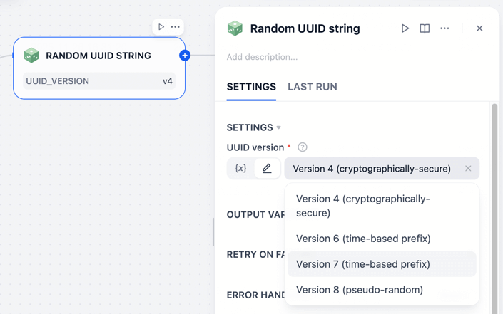

# Random - Generating random numbers and strings

**Author:** [bowenliang123](https://github.com/bowenliang123)

**Github Repository:** https://github.com/bowenliang123/dify-plugin-random

**Dify Marketplace:** https://marketplace.dify.ai/plugins/bowenliang123/random

## Description

A Dify plugin to generate random number, string, UUID, prime number etc.

## Tools

### Random String:

- Generate a random string with given length from alphabets and numbers.
- Input parameters:
    - `include_alphabets`: Include alphabets from both, either or none of [uppercase](https://docs.python.org/3/library/string.html#string.ascii_uppercase) or [lowercase](https://docs.python.org/3/library/string.html#string.ascii_lowercase) alphabets.
    - `include_numbers`: Whether to include [numbers](https://docs.python.org/3/library/string.html#string.digits)
    - `include_punctuation`: Whether to include punctuation characters from `!"#$%&'()*+,-./:;<=>?@[\]^_``{|}~`
    - `string_count`: Number of random strings to generate
- Output: 
    - eg. `TSUWUBoOIu4bZja7mdjTkKteaKVrhz` for requested length of 30.

### Random Number:

- Generate a random number in the given range of [ lower_bound, upper bound ] .
- Input:
    - `lower_bound` and `upper_bound`: The range of random number to generate. Either integer or float is accepted.
    - `num_count`: Number of random numbers to generate
- Output: 
    - If the digits is set to 0, an integer will be generated.

    

    

### Random Prime Number:

- Generate a random prime number in the given range of [ lower_bound, upper bound ] .
- Input:
    - `lower_bound` and `upper_bound`: The range of random prime number to generate. Either integer or float is
      accepted.
- Output: A prime number, or `NaN` if no prime number is found.

### Random UUID:

- Generate a random UUID string in UUID versions of V4, V6, V7 or V8 according to [RFC 9562](https://datatracker.ietf.org/doc/html/rfc9562.html#name-uuid-layouts).

    

    

## Changelog

- 1.0.0
  - Support multiple UUID versions of V4, V6, V7 and V8 in `random_uuid` tool according to [RFC 9562](https://datatracker.ietf.org/doc/html/rfc9562.html#name-uuid-layouts).

- 0.1.0
  - change the random generation from `random` to `secrets` for bett(er randomness and security
  - fix decimal generation with digits guaranteed incase of digits greater than 17

- 0.0.3
  - support generating multiple random numbers

- 0.0.1
  - introducing tools for random number, prime number and UUID v4 generation

## License
- Apache License 2.0

## Privacy

This plugin collects no data.

All the random object generation are completed locally. NO data is transmitted to third-party services.
