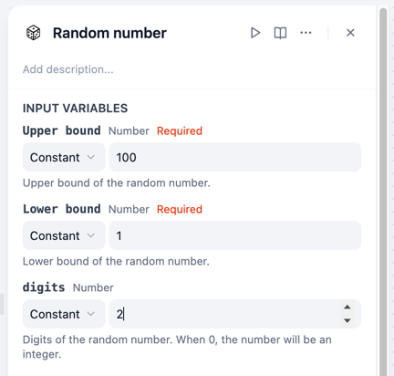
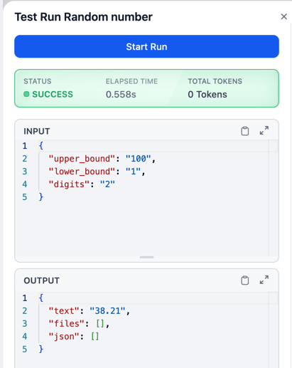
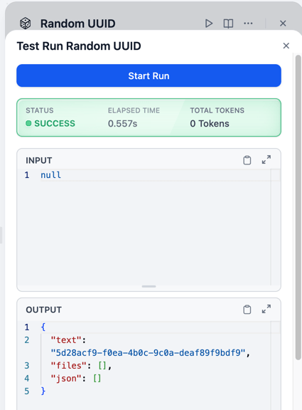

# Random - Generator for random number and string

**Author:** [bowenliang123](https://github.com/bowenliang123)

**Github Repo:** https://github.com/bowenliang123/random

## Description

A Dify plugin to generate random number, string, UUID, prime number and etc.

## Tools

### Random String:
  - Generate a random string with given length from alphabets and numbers.
  - Output: eg. `TSUWUBoOIu4bZja7mdjTkKteaKVrhz` in length 30.

### Random Number:
  - Generate a random number in given range [ lower_bound, upper bound ] .
  - Output: If the digits is set to 0, an integer will be generated.

  
  

### Random Prime Number:
  - Generate a random prime number in given range [ lower_bound, upper bound ] .
  - Output: A prime number, or `NaN` if no prime number is found.

### Random UUID:
  - Generate a random UUID string of UUID v4.

